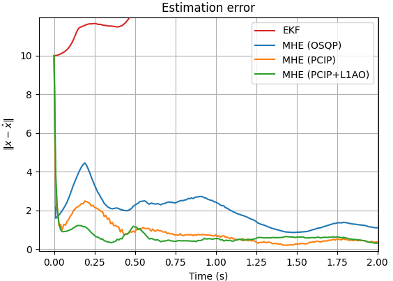
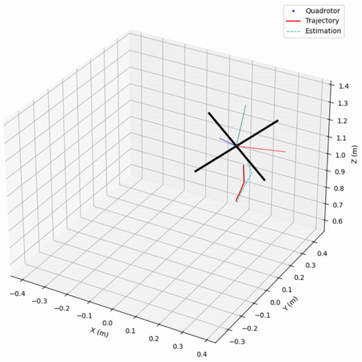

# Moving Horizon Estimation with 𝓛₁ Adaptive Optimizer

- `Paper:` ["Moving Horizon Estimation for Quadrotors: An 𝓛₁ Adaptive Optimizer Approach" (AIAA SciTech 2026)](https://arc.aiaa.org/doi/10.2514/6.2026-1959).
- `What?` In this project, we build a very accurate and efficient solver for MHE/MPC based on time-varying convex optimization.
- `Why?` Conventional approaches treat MHE/MPC as a sequence of independent, time-invariant optimization problems and employ iterative solvers (e.g., OSQP, CVXOPT) at each time step, which can be both inaccurate and computationally burdensome.
- `How?` Time-varying solvers (e.g., PCIP) track the optimal solution with fewer iterations by exploiting the temporal evolution of the problem, thereby reducing computational load. An 𝓛₁-AO augmentation further improves performance by compensating for prediction inaccuracies, which are common in practice due to noisy sensors and lack of prior system knowledge.

  

- `Simulation example:`
    - Quadrotor v2:
        - 12-dimensional, 6 directly measureable states, direct thrust and torque inputs without constraints.
        - Simulate manually: `py simulation\quadrotor2\simulate_quadrotor.py`
        - Animate:           `py simulation\quadrotor2\animate_quadrotor.py`
        - Simulate with pre-configured scenarios (recommended):
            1. Create a scenario JSON file in `simulation\quadrotor2\scenarios` with the desired simulation settings (see descriptions below)
            2. Use the correct JSON file name in `simulation\quadrotor2\simulate_scenario.py`
            3. Run `py simulation\quadrotor2\simulate_scenario.py`

  

## Project structure
- `models/` — dynamical systems used in simulation:
    - `basic.py` — base class `DynamicalSystem`.
    - `quadrotors.py` — `Quadrotor1`, `Quadrotor2`.
    - `chemical.py` — a chemical reactor as an example for constrained MHE.
- `src/` — all important implementations for MHE, PCIP, L1AO, etc.:
    - `kf.py` — Kalman filters (standard and extended) implementation.
    - `mhe.py` — Moving Horizon Estimator implementation:
        - MHE scheme options: filtering (default), smoothing, 'naive' smoothing.
        - MHE prior weighting options: EKF, zero, uniform.
        - Solver options: CVXPY, PCIP, PCIP+L1AO.
        - Developed for linear MHE as a Quadratic Program.
    - `pcip.py` — PCIP implementation for unconstrained Quadratic Programs.
    - `l1ao.py` — L1AO implementation for unconstrained Quadratic Programs.
    - `controllers.py` — basic LQR control for simulation.
    - `simulator.py` — simulation loop / runner utilities.
    - `utils.py` — functions to formulate MHE as Quadratic Programs:
        - Method 1 (inactive): dynamics constraints as equality constraints with Lagrange multiplier.
        - Method 2 (active): dynamics constraints incorporated into the objective function.
- `simulation/` — run simulation here:
    - `quadrotor2/`
        - `simulate_quadrotor.py`: call main() with desired simulation case. Options:
            - Simulation settings:
                - `enabled_estimators`              : Array of estimators to run simulation on; options:
                                                        - `KF`      : standard Kalman filter,
                                                        - `EKF`     : extended Kalman filter,
                                                        - `LMHE1`   : linear MHE using CVXPY (default solver: OSQP),
                                                        - `LMHE2`   : linear MHE using Prediction-Correction Interior Point (PCIP) method,
                                                        - `LMHE3`   : linear MHE using PCIP augmented with L1 adaptive optimizer (L1AO).
                - `T`                               : Simulation duration (seconds)
                - `t0`                              : Time to start estimation RMSE calculation
                - `ts`                              : Sampling period (second)
                - `loops`                           : Number of loops to run
                - `trajectory_shape`                : `p2p` (point-to-point), `circle`, or `triangle`
                - `keep_initial_guess`              : At t=0, each estimator gives a different estimate;
                                                        this override all estimates at t=0 with the initial guess
                - `save_csv_simulation_instance`    : Save high-level information (RMSE) of a simulation loop
                - `save_csv_estimation_error`       : Save estimation error at each time step
                - `save_csv_raw_data`               : Save raw data (state estimates, true states) at each time step
                - `enable_plot`                     : Show plots after simulation finishes
            - Noise settings:
                - `v_means`                         : Measurement noise mean (6-dim array)
                - `v_stds`                          : Measurement noise standard deviation (6-dim array)
                - `w_means`                         : Process noise mean (12-dim array)
                - `w_stds`                          : Process noise standard deviation (12-dim array)
                - `x0_stds`                         : Initial guess standard deviation from the true states (12-dim array)
                - `zero_measurement_noise`          : Simulate without measurement noise
                - `zero_process_noise`              : Simulate without process noise
            - Estimators settings:
                - `Q`                               : Process noise penalty (12-by-12 array)
                - `R`                               : Measurement noise penalty (6-by-6 array)
                - `P0`                              : Initial guess penalty (12-by-12 array)
                - `mhe_horizon`                     : Horizon length for MHE
                - `mhe_update`                      : MHE update method (Rawlings 2017 chapter 4.3.4); options:
                                                        - `filtering`       : arrival cost uses x(T-N|T-N) and P(T-N|T-N-1);
                                                                              this behaves very closely to the EKF in most cases,
                                                        - `smoothing`       : arrival cost uses x(T-N|T-1) and P(T-N|T-1), subtracts
                                                                              an adjustment term; this requires more computation but
                                                                              can outperform the filtering MHE in some cases,
                                                        - `smoothing_naive` : arrival cost uses x(T-N|T-1) and P(T-N|T-N-1), i.e.,
                                                                              skips the covariance backward iteration and adjustment
                                                                              term; this gives faster convergence but more oscillation
                                                                              and can be unstable, and is commonly used in application-
                                                                              based MHE papers.
                - `prior_method`                    : Methods to calculate the covariance P(T-N) for the MHE arrival cost; options:
                                                        - `ekf`     : uses the EKF covariance update (common practice),
                                                        - `zero`    : zero arrival cost, i.e. P(T-N) = ∞,
                                                        - `uniform` : uses a fixed P(T-N) = P0.
                - `lmhe2_pcip_alpha`                : (for PCIP-MHE) PCIP Correction gain
                - `lmhe3_pcip_alpha`                : (for L1AO-MHE) PCIP Correction gain
                - `lmhe3_l1ao_As`                   : (for L1AO-MHE) The diagonal element of the Hurwitz matrix As
                - `lmhe3_l1ao_omega`                : (for L1AO-MHE) Low-pass filter bandwidth
            - Corner case settings:
                - `time_varying_measurement_noise`  : Make measurement noise covariance sinusoidal
                - `bad_model_knowledge`             : Estimators use a wrong dynamics model
                - `time_varying_dynamics`           : Actual mass of quadrotor decreases over time
                - `measurement_delay`               : Delay measurement by how many time steps
        - `animate_quadrotor.py`: run to animate the simulation data saved to `sim_data.npy`.

